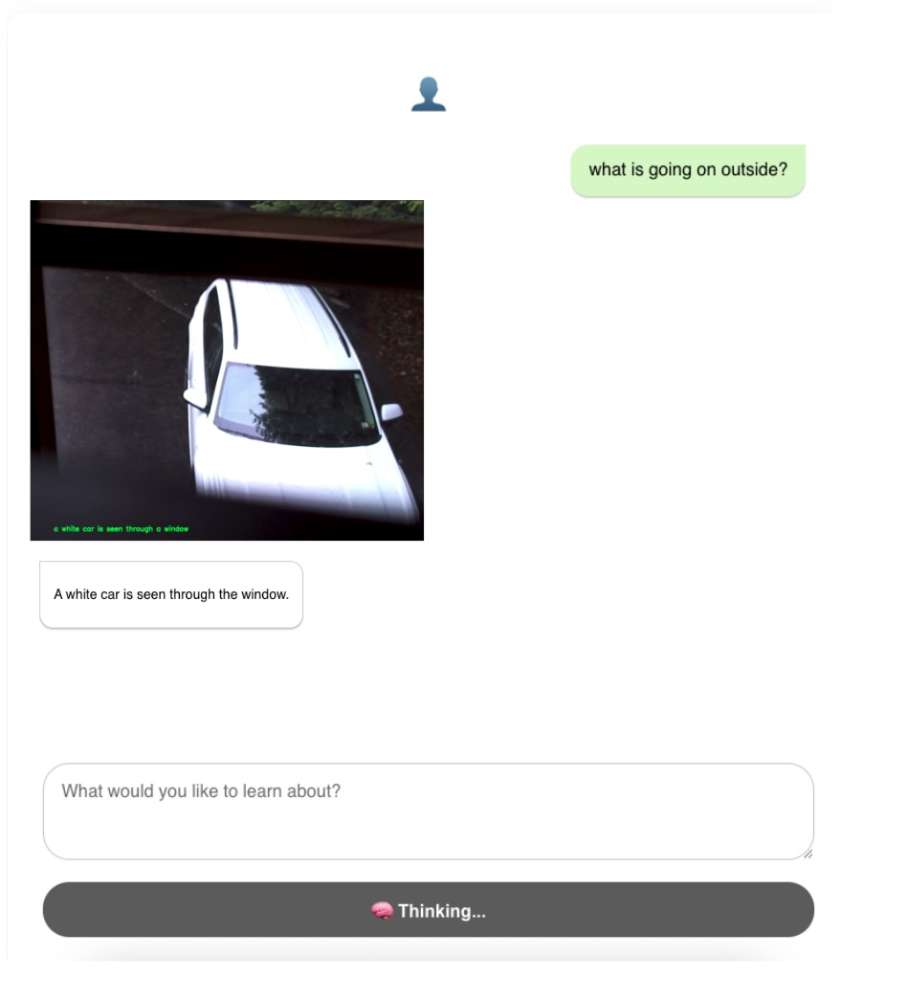
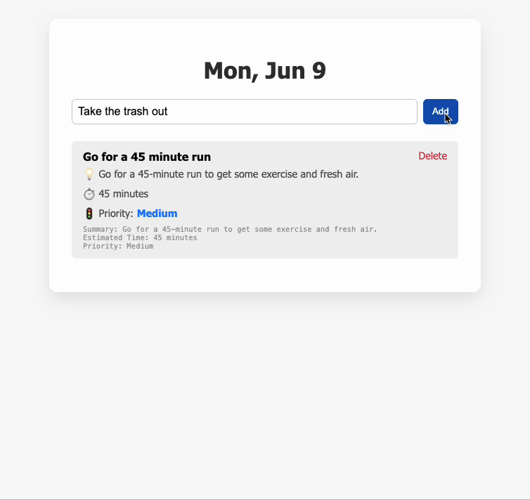
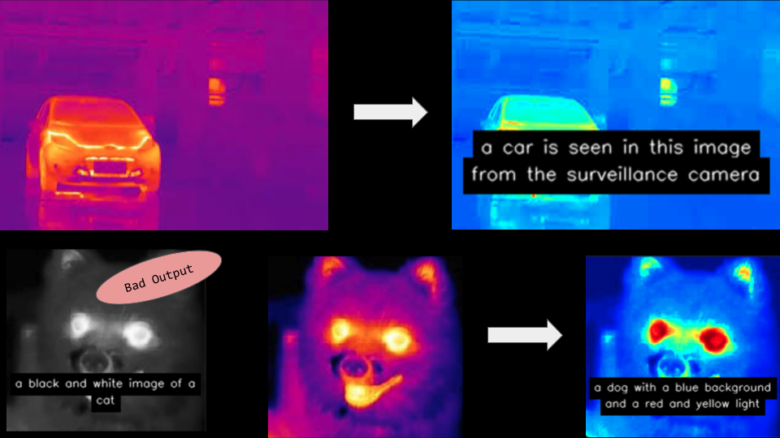
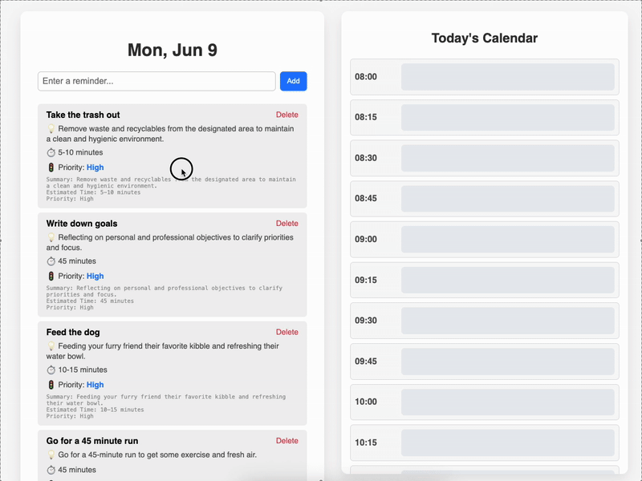

# 🧠 Demo Projects

A showcase of real-world builds—from AI-powered personal tools to rugged home security systems. All projects are fully functional, many developed from scratch, and optimized for real-time performance, privacy, or impact.

| Project | Description |
|--------|-------------|
|  | **AI Chat Security Camera** – An offline home surveillance system with a built-in LLM assistant. Enables natural language querying of events while maintaining full local data privacy. |
|  | **LLM Reminders & Timeboxer** – AI agent that turns freeform notes into smart, scheduled reminders. Integrated with a draggable daily calendar for real-time prioritization and timeboxing. |
|  | **Local LLM Chat UI** – Custom React-based chat client for running private LLMs on-device. Features persistent chat history, Markdown support, and modern Messenger-style UI. |
|  | **BLIP Thermal Security** – DIY thermal imaging add-on for BLIP home monitoring system. Built for sub-$100 setups using off-the-shelf monocles and clever lens alignment. |
|  | **Timeboxing App** – A minimal, real-time task organizer that combines AI-prioritized reminders with a 15-minute interval calendar and auto-updating current time indicator. |

---

## 🔭 What Drives Me

I build systems that matter.

From FDA-cleared cancer diagnostics to global-scale e-commerce infrastructure, I specialize in transforming early-stage prototypes into reliable, compliant, and business-critical platforms. I lead with deep technical empathy and a product-first mindset.

> I believe engineering is a storytelling medium. My teams don’t just ship code — we shape behavior, inform decisions, and deliver value at scale.

---

## 🏥 Making Health Tech Work in the Wild

I've led the engineering, design, and AI teams behind:
- **10+ mission-critical products** across healthcare, financial, and government sectors
- **6 FDA-cleared medical devices**, now in daily use at world-renowned hospitals
- AI integrations including **LLM summarization**, **diagnostic imaging**, and **personalized immunotherapy**

We’ve gone from:
- 4-week release cycles ➡️ daily agile iterations  
- Legacy silos ➡️ Fully distributed cloud backends  
- Manual workflows ➡️ ML-assisted decision support tools  

---

## 🧬 Scaling for Impact

I scale things — systems, teams, and businesses.

- Led engineering orgs from **seed to acquisition** multiple times  
- Scaled platforms to support **100M+ daily users**  
- Drove monetization from MVP ➡️ $50M+ ARR  
- Built GTM-supporting Sales Engineering teams from scratch  
- Took delivery predictability from <10% ➡️ 99%+ across 4 teams  

I approach scaling as a design problem, not just a hiring one. Thoughtful architecture, strong culture, and fast feedback loops win every time.

---

## 🛠️ Some Technologies I Work With

**Core strengths:**  
- Cloud: AWS, Azure, GCP  
- Infra: CDK, CloudFormation, CodeStar  
- Compliance: HIPAA, FDA 510k, GDPR  
- Languages: Python, C#, Node.js, C++, Java  
- AI/ML: Custom neural nets, LLMs, diagnostic imaging pipelines  
- Tooling: GitHub, Jira, Confluence, Sentry, Terraform  

I combine strong architecture chops with an understanding of regulatory environments — rare but essential in healthtech and govtech.

---

## 🎯 Projects at a Glance

| Product | Highlights |
|---------|------------|
| **Podimetrics** | Launched 5 medical device apps in 12 months. 99.9% uptime. Built LLM summarizer for clinical notes. |
| **EcoCart** | 100M+ daily users. Multi-tenant platform used by Walmart, Saks. 30% YoY revenue growth. |
| **BrainSpec** | FDA 510k cleared ML pipeline. Led architecture + Series A pitch work. |
| **BluCloud** | Rugged IoT platform. 3x revenue growth. Predictive flooding AI. |
| **Gritstone** | ML pipelines accelerated COVID-19 vaccine R&D by 6 months. |
| **MXTR** | Built CRM used by Berkshire Hathaway retailers. 2 flagship products in 1 year. |

---

## 📈 Let’s Talk Scale, Speed & Safety

Whether you’re building a first-of-its-kind product or modernizing legacy systems, I bring a track record of navigating complexity — regulatory, technical, or organizational.

I’m always open to connecting around:
- Strategic technical leadership
- Scalable AI/ML architecture
- Regulated market product development
- Rescue projects & turnarounds

---

Want to see the full architecture gallery? [Click here](https://docsend.com/view/532pkryzjj7aa2ua) or reach out.
